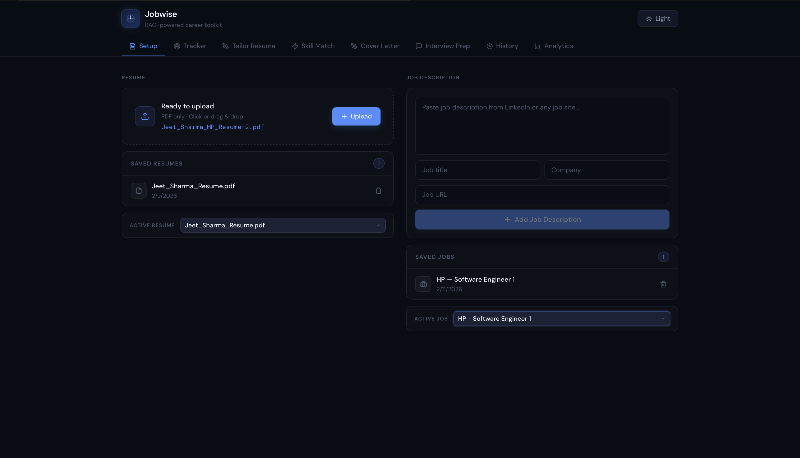
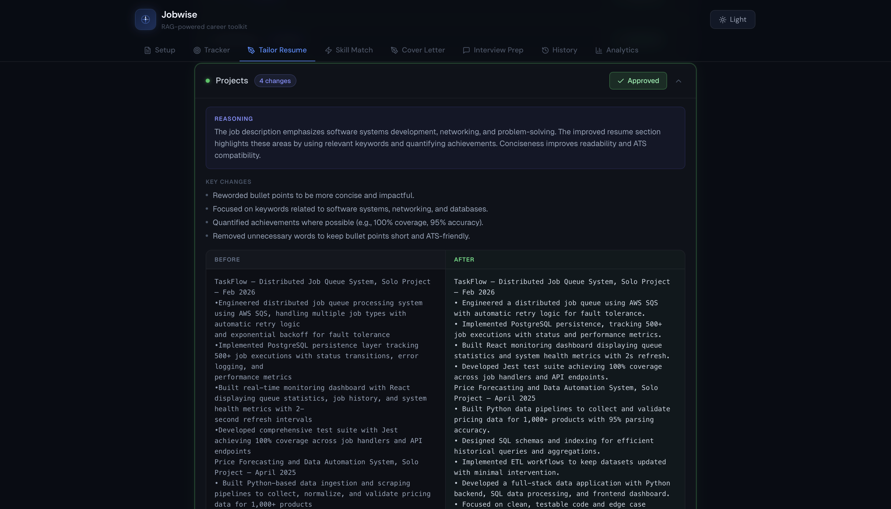
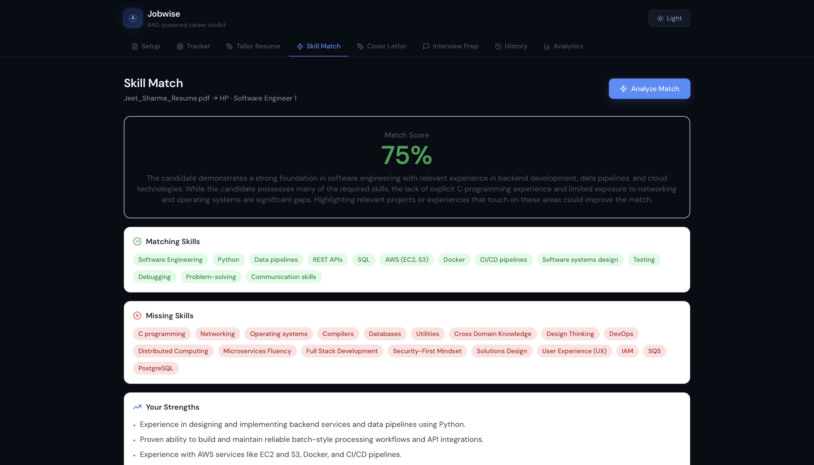
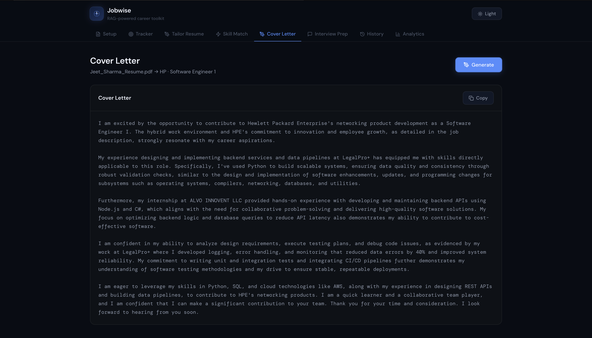
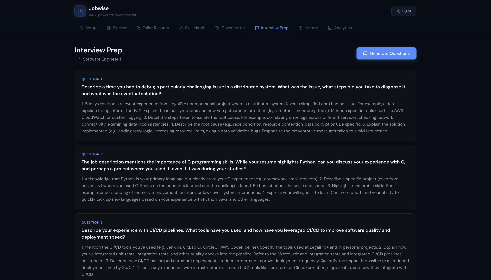
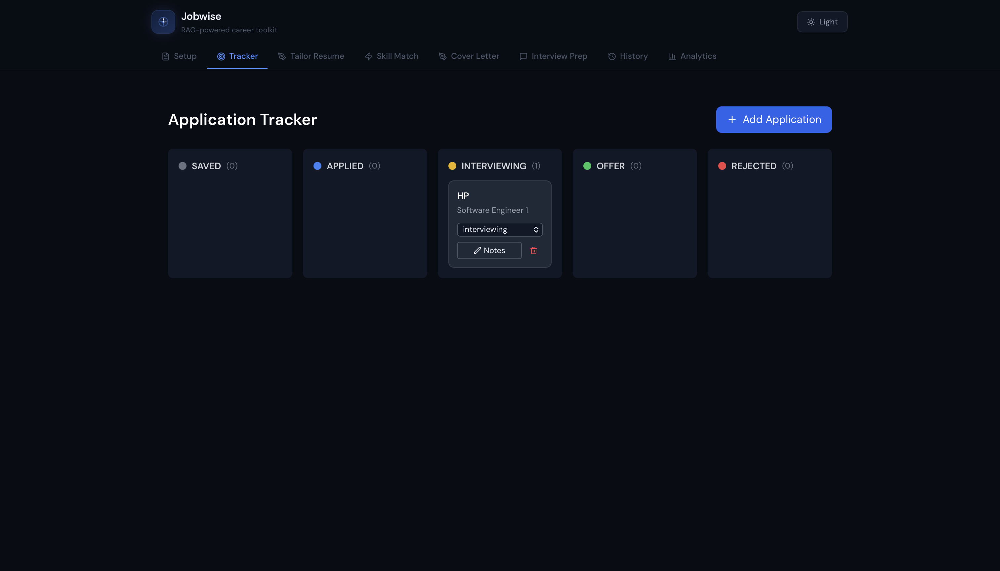
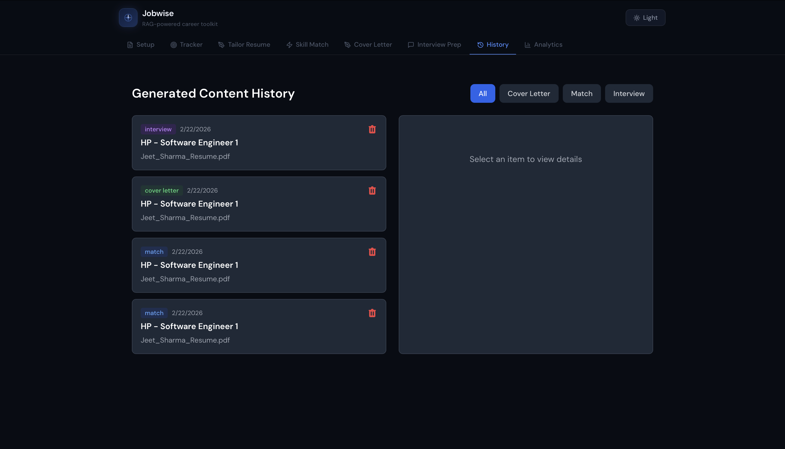
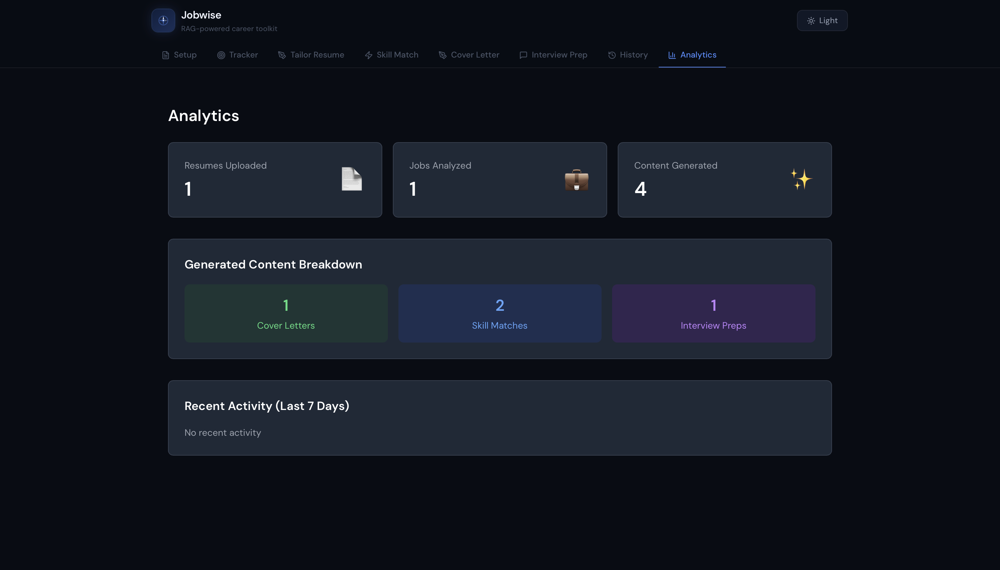

# Jobwise

> RAG-powered job search assistant — tailor your resume, generate cover letters, prep for interviews, and track applications.


---

## Overview

Jobwise takes your resume and a job description and uses retrieval-augmented generation (RAG) to give you a real edge in your job search. Upload your resume once, paste any job description, and get AI-powered tailoring, cover letters, interview prep, and skill gap analysis — all grounded in your actual experience.

---

## Screenshots

### Setup — Upload resume & paste job descriptions



### Resume Tailoring — Section-by-section AI suggestions with before/after comparison



### Skill Match — Semantic similarity scoring with matched and missing skills



### Cover Letter — RAG-generated cover letters grounded in your experience



### Interview Prep — Role-specific questions with suggested answers from your background



### Application Tracker — Kanban board to track every application



### History — Browse all previously generated content



### Analytics — Activity dashboard and content breakdown



---

## Features

**Resume Tailoring** — Upload your resume, paste a job description, and get section-by-section improvement suggestions with reasoning. Approve or reject each change individually, then download the tailored resume as a PDF.

**Skill Match** — pgvector semantic search compares your resume against job requirements and surfaces matched and missing skills with a similarity score.

**Cover Letter Generation** — RAG pipeline retrieves the most relevant parts of your resume and generates a cover letter grounded in your actual experience.

**Interview Prep** — Generates role-specific questions with suggested answers drawn from your background, organized by category.

**Application Tracker** — Kanban board to track every application across Saved → Applied → Interviewing → Offer → Rejected, with notes and date tracking.

**Analytics** — Dashboard showing content breakdown by type and full history of all generated content.

---

## Tech Stack

| Layer          | Tech                                      |
| -------------- | ----------------------------------------- |
| Backend        | Python 3.11+, FastAPI, SQLAlchemy (async) |
| Database       | PostgreSQL + pgvector                     |
| AI             | Google Gemini (generation + embeddings)   |
| Frontend       | React 18, Vite, Tailwind CSS              |
| Parsing        | pdfplumber                                |
| Infrastructure | Docker, Docker Compose                    |

---

## Getting Started

### Prerequisites

- Python 3.11+
- Node.js 18+
- Docker
- Gemini API key

### 1. Clone & configure

```bash
git clone https://github.com/Shadowwyyy/jobwise
cd jobwise
cp .env.example .env
# Fill in your API keys in .env
```

### 2. Start the database

```bash
docker-compose up -d
```

### 3. Start the backend

```bash
cd backend
python -m venv venv
source venv/bin/activate
pip install -r requirements.txt
uvicorn main:app --reload
```

### 4. Start the frontend

```bash
cd frontend
npm install
npm run dev
```

App runs at `http://localhost:5173` — backend API at `http://localhost:8000`.

---

## Environment Variables

```env
GEMINI_API_KEY=your_gemini_key
OPENAI_API_KEY=your_openai_key        # optional fallback
DATABASE_URL=postgresql+asyncpg://...
EMBED_DIMS=3072
```

---

## Project Structure

```
jobwise/
├── backend/
│   ├── app/
│   │   ├── api/                  # Route handlers
│   │   ├── models/               # SQLAlchemy models
│   │   ├── services/             # Business logic & AI calls
│   │   ├── utils/                # PDF generation
│   │   └── core/                 # Config, DB, errors
│   └── main.py
├── frontend/
│   └── src/
│       ├── components/           # React components
│       ├── App.jsx
│       └── index.css
└── docker-compose.yml
```
